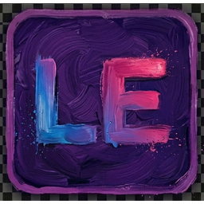
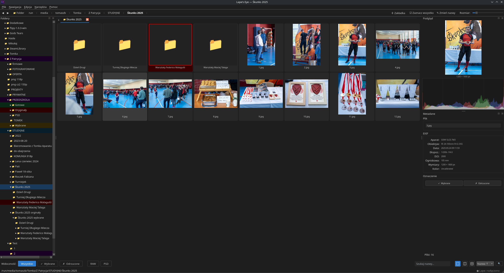

#  Lape's Eye

**A fast, native photo browser and asset manager for Linux** — an open-source alternative to Adobe Bridge.



*Browsing a HEMA tournament photo session — folder tree, thumbnail grid, full EXIF panel and live preview*

---

[](https://github.com/ArtoriasAI/Lapes-Eye-Linux/releases)
[](https://github.com/ArtoriasAI/Lapes-Eye-Linux/releases)
[](#)
[](#)
[](https://paypal.me/ArtoriasAi)

---

## What is Lape's Eye?

**Lape's Eye** is the first application in the **LAPE** suite — *Linux Advanced Photo Editor* — a fully native, open-source photography pipeline for Linux:

| App | Status | Role |
|-----|--------|------|
|  **Lape's Eye** | ✅ Active | Photo browser & asset manager (this app) |
| 🎞️ **Lape RAW Editor** | 🔄 In development | Non-destructive RAW processor |
| 🖼️ **Lape** | 📋 Planned | Full photo editor — open-source Photoshop alternative |

Linux has great photo editors (Darktable, RawTherapee, GIMP) but nothing that works like Adobe Bridge — a fast, non-destructive browser where you rate, filter, and organize thousands of RAW files before editing. **Lape's Eye** fills that gap, and is designed to work seamlessly with the rest of the LAPE suite.

Built natively in **C++20 + Qt6**. No Electron, no Flatpak required, no subscription.

---

## Features

**Browse & Navigate**
- Virtual thumbnail grid — handles thousands of files without slowdown
- Folder tree with color labels and collage previews
- Breadcrumb navigation bar with full history
- Multi-tab support — open several folders simultaneously

**Format Support**
- RAW: ARW, CR2, CR3, NEF, ORF, RAF, RW2, DNG (via libraw)
- Standard: JPEG, PNG, TIFF, WebP, BMP, PSD

**Rate & Filter**
- Star ratings (1–5), color labels, Pick/Reject flags
- Filter bar: All / Picked / Rejected / RAW / PSD
- Batch rename with token support

**Metadata**
- Full EXIF panel — camera, lens, exposure, ISO, dimensions
- Editable annotations saved as `.leye` sidecar files (portable, like XMP)

**Performance**
- SQLite thumbnail cache — fast startup even with large libraries
- Progressive loading with priority queue (visible thumbnails first)
- EXIF-aware RAW rotation

---

## Installation

### Download AppImage (recommended)

Grab the latest `.AppImage` from [Releases](https://github.com/ArtoriasAI/Lapes-Eye-Linux/releases):

```bash
chmod +x LapesEye-*.AppImage
./LapesEye-*.AppImage
```

### Build from source (Arch / EndeavourOS)

```bash
sudo pacman -S --needed cmake qt6-base libraw exiv2 pkgconf base-devel

git clone https://github.com/ArtoriasAI/Lapes-Eye-Linux
cd Lapes-Eye-Linux
chmod +x build.sh && ./build.sh
./build/lapes-eye
```

---

## Keyboard Shortcuts

| Shortcut | Action |
|----------|--------|
| `Enter` | Open selected in Lape editor |
| `1–5` | Set star rating |
| `0` | Clear rating |
| `6–9` | Color label |
| `Ctrl+A` | Select all |
| `F2` | Rename |
| `Ctrl+Shift+R` | Batch rename |

---

## Roadmap

| Version | Status | Highlights |
|---------|--------|------------|
| v0.1–v0.4 | ✅ Done | Core browser, RAW, EXIF, cache, tabs |
| v0.5 | ✅ Done | Virtual grid, breadcrumb, batch rename, color labels |
| v0.6 | 🔄 In progress | Stability, Windows port |
| v0.7 | 📋 Planned | Lape RAW Editor integration — open RAW files directly in the built-in RAW processor |

---

## ❤️ Support Development

Lape's Eye is a solo open-source project. If it saves you from booting Windows just to use Bridge, consider sponsoring:

**[→ Donate via PayPal](https://paypal.me/ArtoriasAi)**

GitHub Sponsors coming soon.

---

## Tech Stack

C++20 · Qt 6 · libraw · exiv2 · SQLite · OpenGL

## License

GPL-3.0
